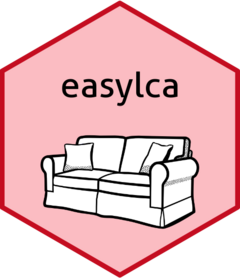

# easylca 

The package is a wrapper around the MplusAutomation package that communicates with MPlus 8.4. It is designed to make conducting a mixed LCA more accessible. 
Please refer to the `define_lca()` function to get started.

The package depends on the `rhdf5` package. Depending on your environment you will need to install the `BiocManager` package first in order to install the `rhdf5` package.
This can be done via the following two commands:
    ``install.packages("BiocManager");
    BiocManager::install("rhdf5")``